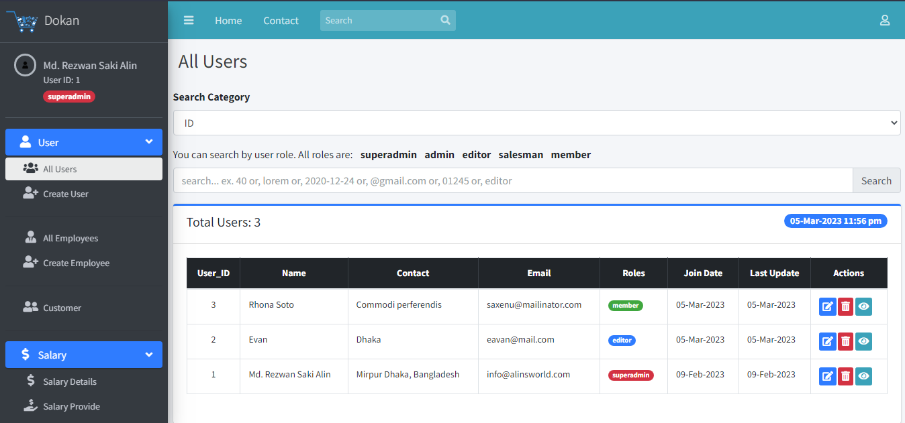

# Lara Dokan - Laravel 8 Project

A simple shop management system for practice. It can help to run a small shop. Such as, paying the employees, managing the product, ePOS etc.

## Instruction:

<ul>
    <li>1. Creating a Database 'lara_dokan' in your database server</li>
    <li>2. composer update</li>
    <li>3. 'npm install' and then 'npm run dev'</li>
    <li>4. php artisan storage:link</li>
    <li>5. copy the file .env.example and rename into .env, then give information of database, server and create app key by 'php artisan key:gen' the save the file</li>
    <li>6. php artisan migrate</li>
    <li>7. php artisan serve</li> 
    <li>8. First time you have to install this app. After 'serve command' this app will show you installation process automatically.</li> 
    <li>9. After installation you will get information to login. You will be a super admin. Now you can access everything.</li> 
</ul>

### Creating employee:

<ul>
At first you have to create a user -
    <li>1. Go to User</li>
    <li>2. Go to 'Create User'</li>
then create a employee -
    <li>3. Go to 'Create Employee'</li>
    <li>4. Select 'User_ID' and give other information</li>
    <li>5. Click the button 'Create Employee'.</li>
</ul>
Note: Deleting Employee will also delete from User table.

### User Role:

<ul>
    <li>superadmin - Default user role, can access everything. It can't be removed from the app.</li>
    <li>admin - As like superadmin.</li>
    <li>editor -  only can full access of product and sales section.</li>
    <li>salesman - only can access (create, read) of ePOS (sales->ePOS) section.
    <li>member - only can access Home, Contact, Register, Login. Member means customer.</li>
</ul>

### About SuperAdmin:

<ul>
<li>After installing this app, a user ID will be created automatically which will be the role of super admin.</li>
<li>The user ID of the super admin cannot be changed. This ID must be 1 at all times.</li>
<li>If the super admin's ID changes due to a mistake, then you have to manually fix it from the users table of the database.</li>
</ul>

### Change TimeZone:

<ul>
<li>Go to app.php of the project folder</li>
<li>(For Asia/Dhaka) Add this line and save</li>
'timezone' => 'Asia/Dhaka',
</ul>

### Database that must obey:

The work of the database must be done through migrate, but it cannot be directly modified by going to the database from database server.

### Extra Packages used:

1. "carlos-meneses/laravel-mpdf": "^2.1" - for generate HTML to PDF.  
2. "spatie/laravel-permission": "^3.18" - for user role permission.  
3. "laravel/breeze": "^1.0" - for authentication.

### Problems:

There are some issues that have not been fixed.  
Such as:  

<ul>
<li>1. Problem in dashboard (left side menus are not arranged properly and clicking on one or reloading the browser opens all menus and2. At the same time, it seems that accessing the software from multiple PCs may cause problems with Invoice ID and other problems as well.</li>
<li>2. At the same time, it seems that accessing the software from multiple PCs may cause problems with Invoice ID and other problems as well.</li>
<li>3. At the very beginning there are installation methods that can be accessed after installation if desired, and the superadmin recover method can also be accessed later. These can cause problems.</li>
<li>4. There was no need for so much about the user. And besides, they also have problems, they are not perfect. Especially the payment of advance salary is not so good.</li>
<li>5. Product table columns should have been done better.</li>
<li>6. Data Input Validation method is not added, it should have been done. Adding validation is causing problems. And without adding validation, If wrong data entry shows a white page but no error.</li>
<li>7. SuperAdmin can be edited by superadmin and admin, this can be a problem. Although the superadmin cannot be removed, it should have been made so that the superadmin cannot be edited in any way from the application.</li>
<li>8. The project was developed for practice without proper planning so there are also problems with database design.</li>
</ul>

### Project Version:

1.0.7

### Start Date:

22-Dec-2020

### Last Update:

01-May-2023

### Developed by:

Md. Rezwan Saki Alin
https://www.alinsworld.com/

### Used Tools:

Laravel 8, Bootstrap free admin template 'AdminLTE 3.0.5'

## License

The Laravel framework is open-sourced software licensed under the [MIT license](https://opensource.org/licenses/MIT).
